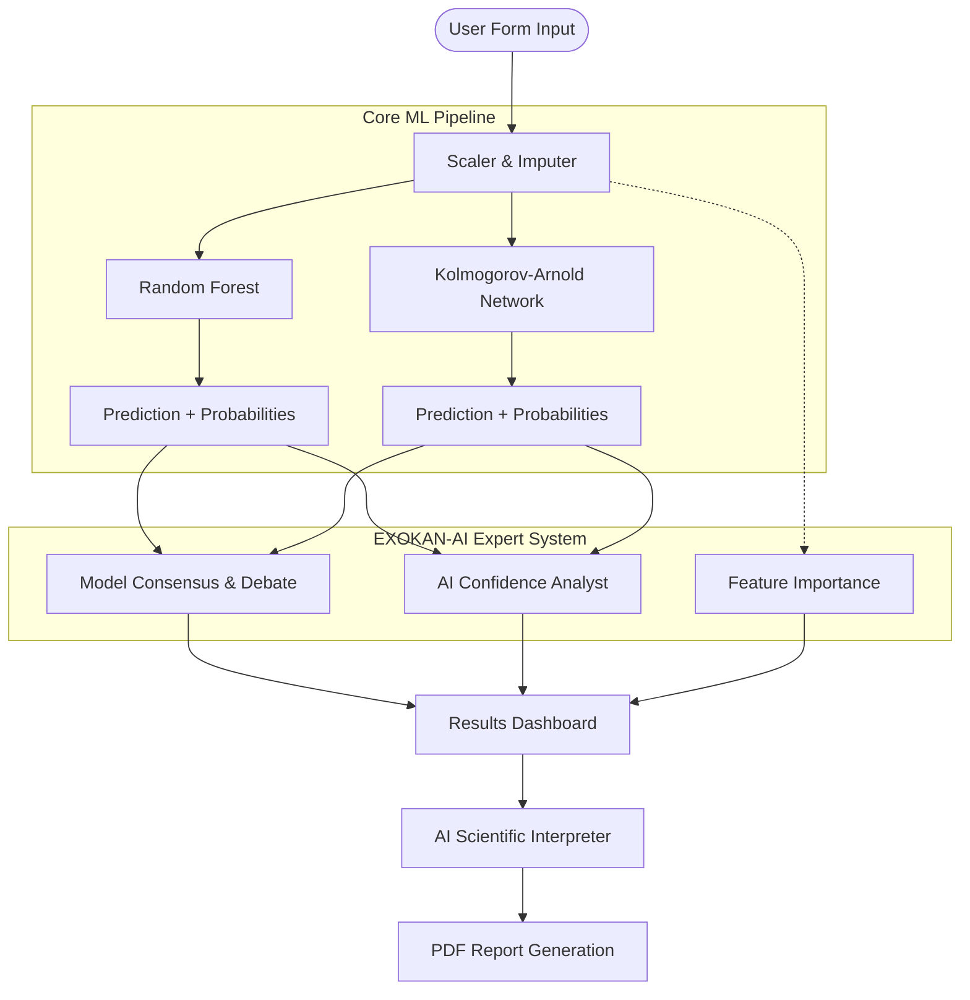

# EXOKAN-AI

**AI-Assisted Exoplanet Classification & Scientific Analysis**

EXOKAN-AI is an advanced, AI-assisted dashboard for the classification of exoplanet candidates using machine learning, deep learning, and explainable AI techniques. It provides an intuitive, space-themed interface built on Streamlit that bridges the gap between raw predictive models and human scientific interpretation.

## Overview

The core of EXOKAN-AI relies on a dual-model architecture:
1. **Random Forest**: An ensemble learning method providing robust tabular classification.
2. **KAN (Kolmogorov-Arnold Network)**: A novel deep learning architecture using continuous, non-linear edge functions for advanced feature representation.

**Important limitation:** The AI layer provides model interpretation and decision support based on learned mathematical patterns. It **does not independently establish astronomical confirmation** without human expert scientific review.

## Architecture



## AI-Assisted Features

EXOKAN-AI provides an entire suite of decision-support features sitting on top of the prediction pipeline:
- **Model Consensus & Debate**: Evaluates where the Random Forest and KAN agree or disagree and explains the implication of their alignment.
- **AI Confidence Analyst**: Analyzes the probability distributions and margins to establish a confidence bound (High, Moderate, Low).
- **Probability Visualization**: Beautiful Plotly-driven horizontal bar charts comparing model probability outputs.
- **Feature Story**: Visualizes the top influential features determining the model's decision for the current sample.
- **AI Scientific Interpreter**: A dynamic text generation system that provides structured, natural language interpretation of the model's decision process (adjustable for Simple or Technical audiences).
- **What-If Analysis**: Interactive simulation that allows researchers to tweak a parameter (e.g., transit depth) and see how it impacts model confidence in real-time.
- **AI Chat Assistant**: A context-aware chat interface for probing the model's logic.
- **PDF Report Generation**: One-click generation of a comprehensive scientific report using `fpdf2`.

## Requirements

Ensure the virtual environment is activated:
```bash
python -m venv venv
.\venv\Scripts\activate
pip install -r requirements.txt
```

Key dependencies:
- `streamlit`
- `torch`
- `scikit-learn`
- `pandas`
- `numpy`
- `plotly`
- `fpdf2`

## How to Run

1. Train the models if not already done:
```bash
python src/train_rf.py
python src/train_kan.py
```
2. Launch the EXO-AI Dashboard:
```bash
.\venv\Scripts\streamlit run app/streamlit_app.py
```
*(Ensure you use the python executable from your activated virtual environment)*
