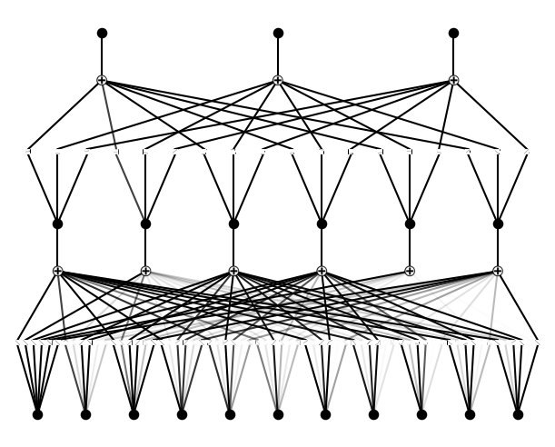
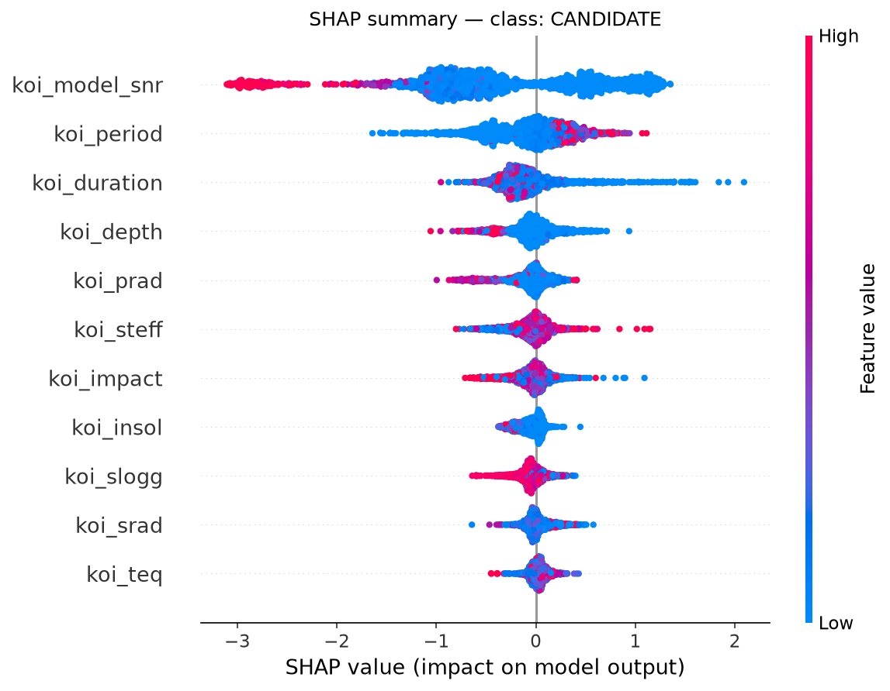
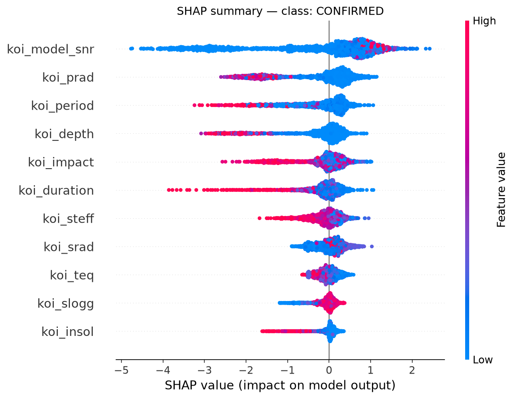
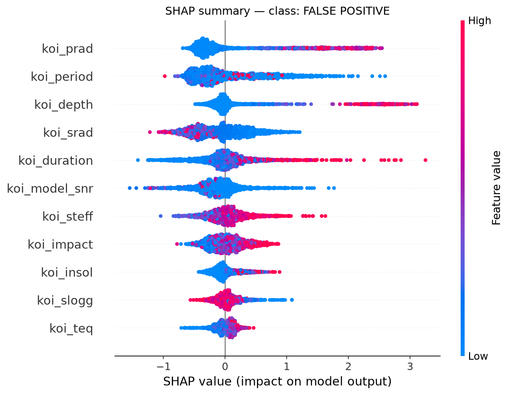
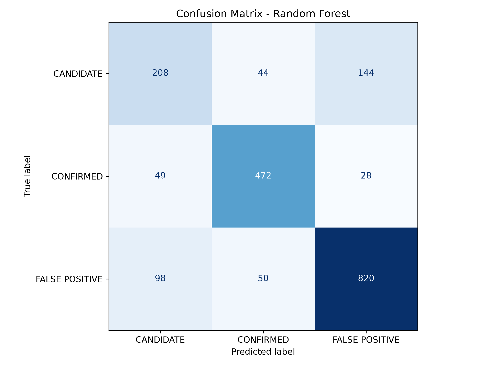
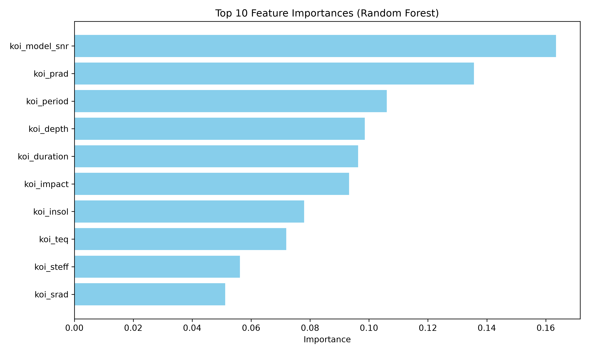

# Interpretable Exoplanet Candidate Classification using Kolmogorov-Arnold Networks (KAN)

## Problem Statement
NASA's Kepler and TESS missions flag thousands of Kepler Objects of Interest (KOIs) —
potential exoplanet detections based on the transit method. Most of these are false
positives (eclipsing binaries, instrumental noise, stellar variability), and separating
real candidates from noise currently relies on complex, largely manual vetting pipelines
that don't scale.

Black-box ML models can classify these quickly, but astronomers need to understand
*why* a detection was flagged a certain way before trusting or acting on it — especially
before committing expensive follow-up telescope time (e.g., JWST).

## Solution
This project trains a **Kolmogorov-Arnold Network (KAN)** — a 2024 neural architecture
that is interpretable *by design* (each edge learns an explicit, visualizable function,
rather than a fixed weight + activation) — to classify KOIs as `CONFIRMED`, `CANDIDATE`,
or `FALSE POSITIVE` based on stellar and transit measurements.

KAN performance and interpretability are benchmarked against Random Forest and XGBoost
baselines (explained post-hoc via SHAP), directly contrasting "interpretable by design"
vs. "explained after the fact."

## Dataset
[NASA Exoplanet Archive — Kepler Objects of Interest (KOI) cumulative table](https://exoplanetarchive.ipac.caltech.edu/cgi-bin/TblView/nph-tblView?app=ExoTbls&config=cumulative)
(public, ~9,500 rows, tabular). Download as CSV and place at `data/raw/koi_cumulative.csv`.

## Project Structure
```
exoplanet-kan-classifier/
├── data/
│   ├── raw/              # place koi_cumulative.csv here
│   └── processed/
├── src/
│   ├── data_loader.py    # loads raw CSV
│   ├── preprocess.py     # cleaning, feature selection, train/test split
│   ├── train_kan.py      # trains the KAN model
│   ├── train_baselines.py# trains Random Forest + XGBoost
│   └── interpret.py      # KAN activation plots + SHAP comparison
├── app/
│   └── streamlit_app.py  # interactive demo
├── models/                # saved trained models (generated)
├── results/                # metrics, plots (generated)
├── notebooks/                # exploratory analysis
└── requirements.txt
```

## Setup
```bash
python -m venv venv
source venv/bin/activate    # or venv\Scripts\activate on Windows
pip install -r requirements.txt
```

## Usage
```bash
# 1. Download data (see Dataset section) into data/raw/koi_cumulative.csv

# 2. Train baselines
python src/train_baselines.py

# 3. Train KAN
python src/train_kan.py

# 4. Generate interpretability plots
python src/interpret.py

# 5. Run the demo app
streamlit run app/streamlit_app.py
```

## Results

| Model | Macro F1 | Accuracy |
|---|---|---|
| Random Forest | 0.7458 | 0.7841 |
| XGBoost | 0.7403 | 0.7804 |
| KAN (100 steps, width=[11,6,3]) | 0.7099 | 0.76 |

**Per-class F1 comparison:**

| Class | Random Forest | XGBoost | KAN |
|---|---|---|---|
| CANDIDATE | 0.55 | 0.54 | 0.48 |
| CONFIRMED | 0.85 | 0.84 | 0.83 |
| FALSE POSITIVE | 0.84 | 0.84 | 0.82 |

**Hyperparameter note:** training steps were swept (50 / 100 / 200) to find the
generalization sweet spot before overfitting — 200 steps drove train_loss down
(5.88e-01) but test_loss *up* (9.51e-01), a clear overfitting signature. 100 steps
gave the lowest test_loss (7.58e-01) and was selected as the final model.

## Key Takeaway

**On accuracy:** Random Forest and XGBoost both edge out KAN by roughly 3-4 points
of macro F1 (0.746 and 0.740 vs. 0.710), with the gap consistent across all three
classes rather than concentrated in one. This is an honest, expected result — tree
ensembles are a mature, highly-tuned architecture for tabular data, while KAN is a
2024 architecture without the same years of tuning tricks built up around it. The
gap is real but modest, and it's not the headline finding of this project.

CANDIDATE is the hardest class for all three models (F1 0.48–0.55) — consistent with
it being, by NASA's own labeling convention, the class where the original vetting
pipeline itself couldn't confidently call a detection real or false. Every model's
difficulty here mirrors genuine ambiguity in the underlying data, not just a
limitation of any one architecture.

**On interpretability — the core argument of this project:** the accuracy gap is
the price of trading a small amount of raw performance for a fundamentally different
kind of transparency. SHAP analysis on the XGBoost baseline required three separate
post-hoc explanation runs (one per class) to reveal that `koi_model_snr` drives
CONFIRMED predictions, while `koi_prad` and `koi_period` dominate FALSE POSITIVE
predictions — consistent with the physical intuition that high signal-to-noise
transits look like real planets, while implausible radius/period combinations flag
likely eclipsing binaries. The KAN's learned edge functions, visualized directly
from `kan_activation_functions.png`, show the same `koi_model_snr` pathway carrying
strong, high-magnitude connections toward the CONFIRMED output — **without requiring
any additional explanation step**. Two independent interpretability methods converge
on the same finding, but one needed extra tooling (SHAP, run per-class, after
training) and one was inherent to the trained model itself.

That distinction — interpretable *by design*, at a modest accuracy cost, vs.
higher raw accuracy that needs separate post-hoc tooling to explain — is the
practical trade-off this project demonstrates. In a domain like astrophysics, where
scientists need to sanity-check a model's reasoning against known physics before
committing expensive telescope time, that trade-off can be well worth making.

## Visualizations

**KAN — interpretable by design:**


*Learned activation functions on every edge of the trained KAN — visible directly from the model, no separate explanation step required.*

**XGBoost — explained post-hoc via SHAP (one plot per class):**





**Baseline model diagnostics:**





## Tech Stack
Python, PyTorch, pykan, scikit-learn, XGBoost, SHAP, Streamlit, pandas, matplotlib
